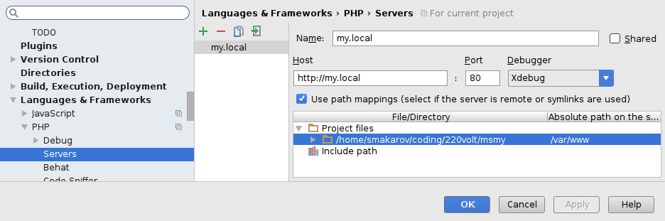

# Docker commands

This docker container has been build following [this steps](https://gist.github.com/jehaby/61a89b15571b4bceee2417106e80240d).

By default the docker container I use, has no a php.ini file. I needed some extra configuration so I create a local `php.ini` 
file and I copied to the container ```COPY php/conf/php.ini /usr/local/etc/php/```


**Build the container**
```
docker build -t docker-php .
```

**Run the container**
```
docker run -v {{path-to-project-folder}}:/var/www/html/ -e XDEBUG_CONFIG="remote_host={{your-ip}}" -p 80:80  docker-php
```

If you are a mac user and your project is not located in the allowed folders by Docker you should add that and restart Docker.
You can check 

### PhpStorm configuration
In Intellij/PHPStorm go to: `Languages & Frameworks` > `PHP` > `Servers` > and set the following settings:



> Name: name of your server, should be equal to value in `PHP_IDE_CONFIG` variable
  
Then you're all set and can start listening for PHP Debug connections from your IDE